# Workflow Automation — User Guide

This is the complete, screenshot-illustrated guide to GWS Business Suite's Workflow Automation
area (`/admin/automation`) — an n8n-style visual automation builder that runs entirely inside
this app, with no external automation service and no data leaving your own infrastructure unless
a node you configure calls out (e.g. HTTP Request).

Screenshots were captured directly from a live GWS Business Suite instance. For the engineering
design behind this system (architecture, capability matrix, delivery history), see
[`WORKFLOW_AUTOMATION.md`](WORKFLOW_AUTOMATION.md) — this guide is the operator-facing companion
to that document.

## Contents

1. [Core concepts](#core-concepts)
2. [The workflow list](#the-workflow-list)
3. [Creating a workflow](#creating-a-workflow)
4. [The editor](#the-editor)
5. [Trigger nodes](#trigger-nodes)
6. [Action nodes](#action-nodes)
7. [Data and flow nodes](#data-and-flow-nodes)
8. [AI nodes](#ai-nodes)
9. [Connections and branching](#connections-and-branching)
10. [Expressions and data mapping](#expressions-and-data-mapping)
11. [Validating and publishing](#validating-and-publishing)
12. [Running a workflow and reading results](#running-a-workflow-and-reading-results)
13. [Retry from a failed node](#retry-from-a-failed-node)
14. [Time-travel replay](#time-travel-replay)
15. [Credentials](#credentials)
16. [Versions and rollback](#versions-and-rollback)
17. [Workflow settings](#workflow-settings)
18. [Sharing a workflow (per-workflow access)](#sharing-a-workflow-per-workflow-access)
19. [Public status pages](#public-status-pages)
20. [Starter workflows and templates](#starter-workflows-and-templates)
21. [Import and export](#import-and-export)
22. [Agentic authoring with SentinelGPT](#agentic-authoring-with-sentinelgpt)
23. [Suite-wide search and Mission Control](#suite-wide-search-and-mission-control)
24. [Mobile push approvals (server-side readiness)](#mobile-push-approvals-server-side-readiness)
25. [Security and audit trail](#security-and-audit-trail)
26. [End-to-end tutorial: notify on a big CRM deal](#end-to-end-tutorial-notify-on-a-big-crm-deal)
27. [Known limitations](#known-limitations)

---

## Core concepts

A **workflow** is a directed graph of **nodes** connected by **connections**. Every workflow has
exactly one job: start from a **trigger**, move an in-memory JSON "item" through a sequence of
**action**, **data**, and **flow** nodes, and finish. Each node reads the item(s) it receives,
does something, and passes its own output item(s) to whatever it's connected to.

- **Trigger nodes** start a workflow. A workflow needs at least one enabled trigger to be valid.
- **Action nodes** do something with a real side effect — send an email, write a CRM/CMS record,
  call an HTTP API.
- **Data and flow nodes** are pure — they transform, branch, filter, merge, or pace the items
  flowing through the graph, with no external side effect.
- **AI nodes** call this app's own self-hosted Ollama models (no external LLM API).

A workflow has a **draft** (what you're editing) and, once you **publish** it, an **immutable
published version** (what actually runs). Editing the draft never changes live behavior until you
publish again — this is the same model as "save vs. deploy."

## The workflow list

`/admin/automation` lists every workflow you have access to, with status, node count, current
version, last-run time, and tags. The banner at the top surfaces recent failures across every
workflow so a broken automation is visible the moment you open the page.

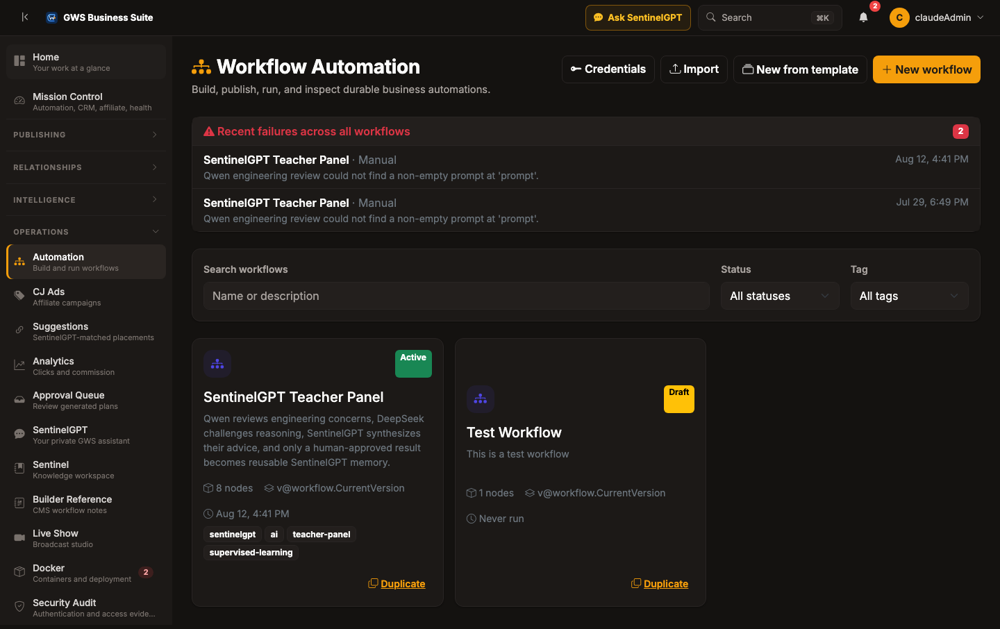

From here you can create a workflow, start from a starter or saved template, import an exported
workflow file, or open the credential vault.

## Creating a workflow

Click **New workflow**, give it a name and description, and you're dropped straight into the
editor with a Manual Trigger node already on the canvas, ready to connect.

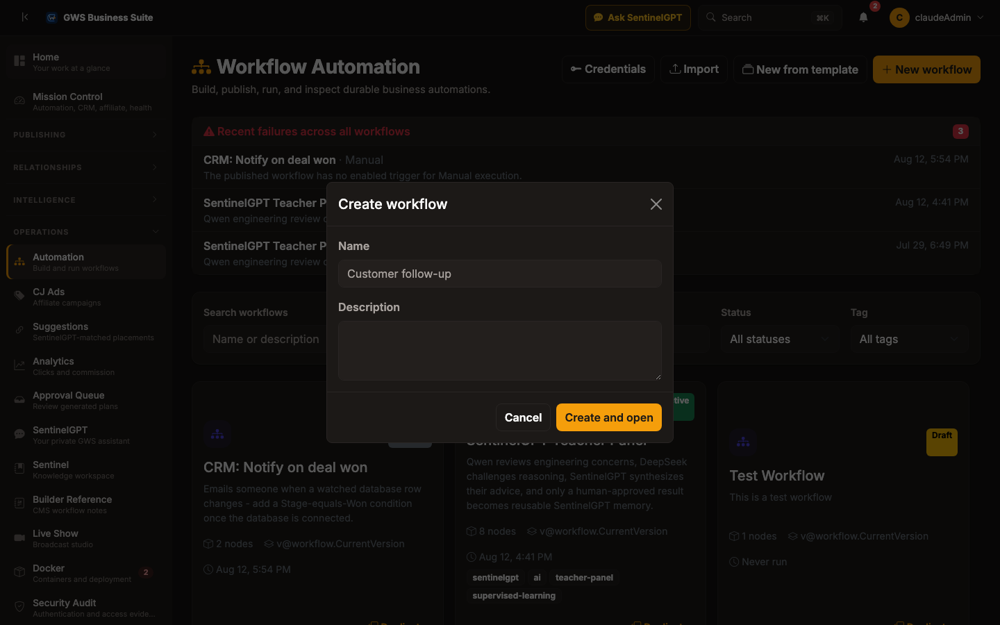

## The editor

The editor (`/admin/automation/{id}`) has three panels:

- **Left: the node palette.** Every available node type, grouped into Triggers, Actions, Flow,
  Data, and AI, with a live search box. Drag or click a node onto the canvas to add it.
- **Center: the canvas.** Your workflow's graph. Click a node to select it, drag to reposition,
  drag from one node's output dot to another's input dot to connect them. Ctrl/Cmd-click or
  shift-click to multi-select; Ctrl/Cmd+C / Ctrl/Cmd+V to copy and paste a selection (including its
  internal connections); Ctrl/Cmd+Z / Ctrl/Cmd+Y to undo/redo node and connection deletions. A
  minimap in the corner gives an overview on larger graphs.
- **Right: the node inspector.** Select a node to edit its name, parameters (as JSON, with
  `{{ expression }}` support), notes, credential, and execution policy (continue-on-fail,
  retry-on-fail with attempt count and backoff, timeout).

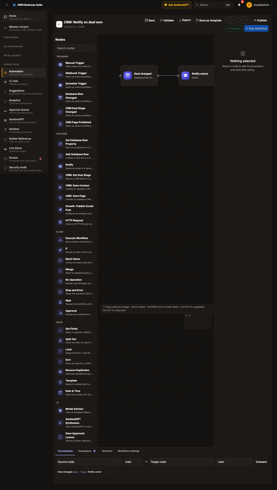

Selecting a node opens its settings panel on the right:

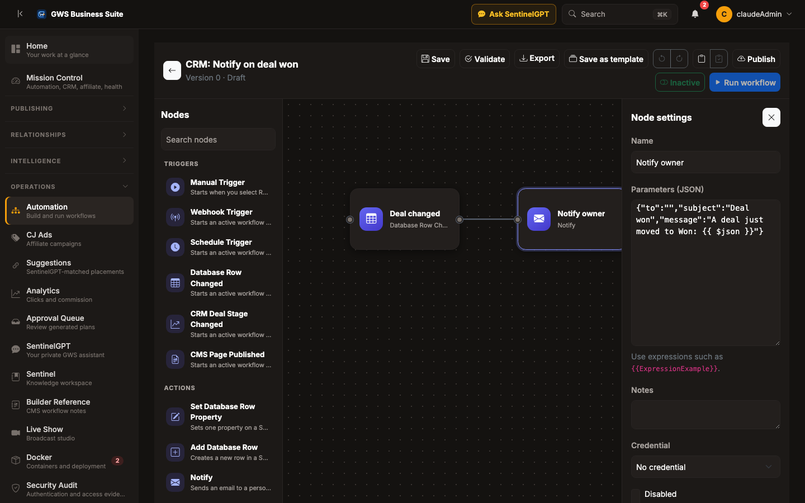

The toolbar above the canvas has Save, Validate, Export, Save as template, undo/redo, copy/paste,
Publish, an Active/Inactive toggle, and Run workflow (a manual test run against the current
draft).

## Trigger nodes

| Node | What starts the workflow |
| --- | --- |
| **Manual Trigger** | You clicking "Run workflow," or a call with no other mode specified. |
| **Webhook Trigger** | A POST to this workflow's public webhook path, once the workflow is Active. Attach a credential with a `secret` value to require a shared secret; without one, the webhook is unauthenticated by design (a legitimate choice for a workflow with nothing sensitive to leak, but you should know it's happening). |
| **Schedule Trigger** | A recurring interval in minutes, or a 5-field cron expression (`minute hour day-of-month month day-of-week`, supporting `*`, numbers, comma lists, `N-M` ranges, and `*/S` steps — e.g. `0 9 * * 1` for every Monday at 9am). If both are set, cron wins. |
| **Database Row Changed** | A row's properties change in a specific Sentinel database. Paste the database's id (visible in its Sentinel URL). Optionally add `conditions` (each `{propertyId, operator: equals\|notEquals\|contains, value}`, ANDed together) so it only fires when the new values match — leave empty to fire on any change. |
| **CRM Deal Stage Changed** | A CRM deal's pipeline stage changes. Leave `toStage` empty to fire on any stage change, or set it (e.g. `"Won"`) to fire only when a deal reaches that stage. |
| **CMS Page Published** | A CMS page transitions from Draft to Published. Fires at the moment a page actually becomes visible — a page scheduled for a future publish date fires this trigger when that time arrives, not when it was scheduled (see [Known limitations](#known-limitations) for what "scheduled" means here). |

A published workflow can have at most one enabled Webhook Trigger and one enabled Schedule
Trigger, but any number of Database Row Changed / CRM / CMS triggers, and any mix of trigger types
in the same workflow (whichever one actually fires starts that run).

## Action nodes

| Node | What it does |
| --- | --- |
| **Set Database Row Property** | Sets one property on a Sentinel database row. Never re-triggers a Database Row Changed workflow on the same write by default (see [Opt-in automation chaining](#workflow-settings)). |
| **Add Database Row** | Creates a new row in a Sentinel database; `propertyValues` maps property ids to values (expression-capable), `parentRowId` is optional for sub-items. |
| **Execute Workflow** | Runs another *published* workflow to completion synchronously and returns its output as this node's output. The child must not pause on Wait/Approval. Calls are depth-capped at 10 and self/mutual recursion is rejected with a clear error. |
| **Notify** | Sends an email. `to`/`subject`/`message` all support `{{ expression }}`. For webhook-style alerts to another system, use HTTP Request instead — this node is specifically email. |
| **CRM: Set Deal Stage** | Moves a CRM deal to a new pipeline stage. |
| **CRM: Save Contact** | Creates or updates a CRM contact; omit `contactId` to create one. |
| **CMS: Save Page** | Creates or updates a CMS page on a site; omit `pageId` to create one. |
| **Growth: Publish Social Post** | Publishes an already-drafted social post (draft it first in Growth Studio's composer). |
| **HTTP Request** | Calls any HTTP API and returns status, headers, and response data. Attach an `httpHeader` credential to send an auth header without it ever appearing in plain text on the canvas. |

## Data and flow nodes

These never leave the app and never have an external side effect:

- **Set Fields** — adds or replaces JSON fields using literal values or expressions.
- **If** — routes an item to a `true` or `false` output based on a comparison (`equals`,
  `notEquals`, `contains`, `exists`, `greaterThan`, `lessThan`).
- **Split Out** — emits one item for each value in an array field (fan-out).
- **Batch Items** — groups an input array into smaller batches.
- **Merge** — waits for every labeled input port it's connected to, then combines them into one
  item. Needs at least two distinct input labels (e.g. `input1`/`input2`) to be valid.
- **Limit** — keeps the first or last N items from an array.
- **Sort** — sorts an array by a JSON field.
- **Remove Duplicates** — removes repeated array items by a chosen field.
- **Template** — builds formatted text from the current item using `{{ expression }}`.
- **Date & Time** — adds the current UTC time in ISO and Unix formats.
- **No Operation** — passes input through unchanged; useful for layout/debugging.
- **Stop and Error** — stops the workflow with a configured error message.
- **Wait** — pauses the workflow until a duration elapses, a specific timestamp arrives, or a
  resume webhook is called.
- **Approval** — pauses the workflow for a human decision (Approve/Reject), optionally with a
  timeout after which it's treated as expired.

## AI nodes

Three nodes built around this app's self-hosted Ollama models and SentinelGPT:

- **Model Adviser** — asks an installed Ollama model (e.g. `qwen2.5-coder`, `deepseek-r1`) for
  bounded specialist advice on the current item and appends it to the output.
- **SentinelGPT Synthesize** — asks SentinelGPT to reconcile specialist advice into one
  evidence-aware proposed answer.
- **Save Approved Lesson** — stores a human-approved SentinelGPT answer as reusable learning
  memory. Rejected or unapproved items are never stored.

## Connections and branching

Drag from a node's output dot to another node's input dot to connect them. Most nodes have a
single `main` output; **If** has `true`/`false` outputs; **Approval** has `approved`/`rejected`
outputs. A node runs once for every item it receives on any connected input, and its own output(s)
fan out to everything connected downstream. Adding a connection that would create a cycle is
rejected immediately with a clear error — the graph must stay a DAG (directed acyclic graph).

## Expressions and data mapping

Any string parameter can use `{{ }}` expressions:

- `{{ $json.path.to.field }}` — a field on the current item.
- `{{ $node("Node Name").json.path }}` — a field on any earlier node's last output *this run*,
  addressed by the node's display name. This persists through Wait/Approval pauses and crash
  recovery, so it's safe to reference even in a long-running workflow.

This is deliberately a lightweight templating layer, not a full expression language — there's no
arithmetic, no functions, no array indexing beyond dotted paths. For real transformation logic, use
Set Fields, Template, or an HTTP Request to a small service you control.

## Validating and publishing

**Validate** checks the draft against every structural rule this engine enforces (at least one
node, at least one trigger, no unknown node types or malformed parameters, at most one enabled
Webhook/Schedule trigger, Merge nodes have 2+ distinct inputs, no dangling connections, no cycles)
and reports every problem at once.

**Publish** validates, then snapshots the current draft as a new **immutable version** (position-free,
content-only) and makes it the version that actually runs. Publishing does not activate the
workflow — you still need to flip the Active/Inactive toggle for triggers other than Manual to
actually fire.

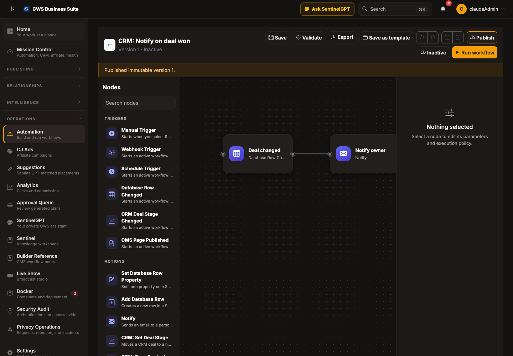

## Running a workflow and reading results

**Run workflow** starts a manual execution against the current *published* version, looking for an
enabled Manual Trigger node specifically. If the workflow's trigger is something else (Webhook,
Schedule, a database/CRM/CMS trigger), Run workflow fails with a clear message rather than
guessing — those triggers fire on their own condition, not on demand from this button.

Every execution's per-node evidence (input, output, status, timing, error) is recorded and
viewable from the Executions tab, including for a run that failed partway through:

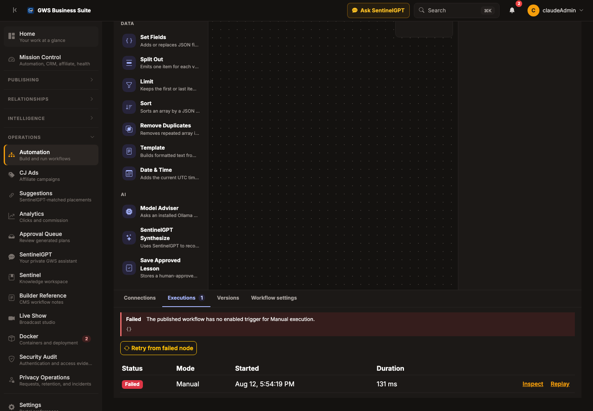

## Retry from a failed node

A failed execution's checkpoint isn't discarded — **Retry from failed node** starts a *new*
execution that resumes from exactly the node that failed, using its own recorded input, rather
than re-running the whole workflow from the start. Non-side-effecting work upstream of the failure
is never repeated. (One known caveat: a node that failed while a sibling merge input was still in
flight may not reconstruct that merge state perfectly — this is a documented limitation, not a
bug, and affects only workflows using Merge nodes.)

## Time-travel replay

**Replay** re-runs a past execution's exact recorded trigger input against the *current published
graph*, as a sandboxed dry run: every node with a real side effect (HTTP calls, CRM/CMS/Sentinel
writes, emails, AI model calls) is never actually executed — its output is substituted from what
it recorded the first time. Pure data/flow nodes (If, Set Fields, etc.) run for real against the
original input, which is exactly the point: replay answers "what would *today's* logic do
differently with the same trigger that fired before," with zero real side effects.

If today's logic takes the graph somewhere the original run never went — a node with a real side
effect that has no recorded output to fake — replay fails with a clear message naming that node,
rather than guessing what it would have done. Workflows that paused on Wait/Approval can't be
replayed (there's no recorded "what resumed it" to replay from).

## Credentials

`/admin/automation/credentials` stores protected secrets (API keys, tokens, webhook secrets)
referenced by id from node parameters — the secret itself is never shown again once saved, and
never appears on the canvas. OAuth2-type credentials support both a manual "Refresh" action and an
automatic 15-minute background sweep that refreshes anything expiring within the next hour.

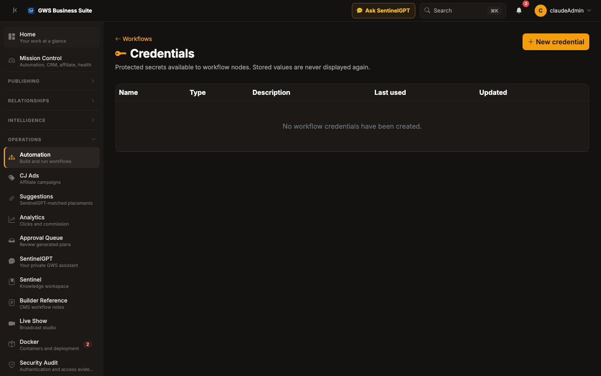

## Versions and rollback

The Versions tab lists every published version with its change summary, publish date, and node
count, and can show a coarse diff (added/removed/modified nodes and connections) between any two
versions.

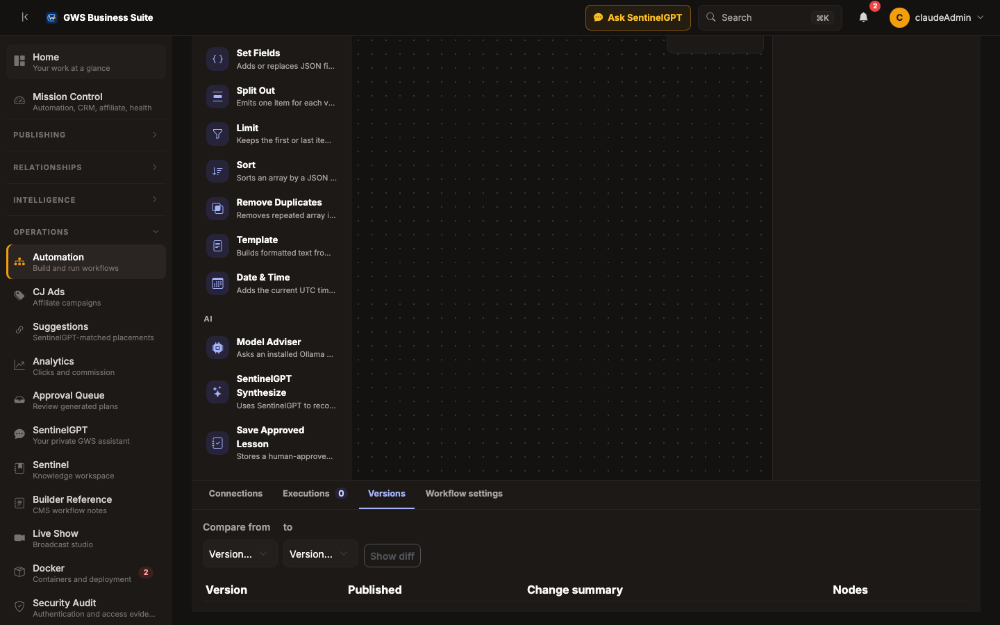

**Restore to draft** replaces your current draft with a past version's content — it does not
rewrite already-published history (the same semantics as `git revert`, not a history rewrite). You
still need to Publish again to make the restored content live.

## Workflow settings

The Workflow settings tab holds description, tags, manual-run input JSON, and one governance
toggle:

- **Allow this workflow's database writes to trigger other automations** — off by default. This
  workflow's `Set Database Row Property`/`Add Database Row`/CRM/CMS action nodes normally write
  under an actor tag that a Database Row Changed (or CRM/CMS) trigger elsewhere deliberately
  ignores, specifically to prevent an automation write from re-triggering itself into an infinite
  loop. Turn this on only if you understand and want a *different* workflow's trigger to react to
  this workflow's own writes.

## Sharing a workflow (per-workflow access)

Automation is normally restricted to admins. An admin can grant a specific Author or Contributor
teammate full access to *just one workflow*, without making them an admin — they still need their
own GWS account; this doesn't create one. This is a binary grant (full access to that one
workflow, not a tiered view/edit split) and is managed from the same Workflow settings tab:

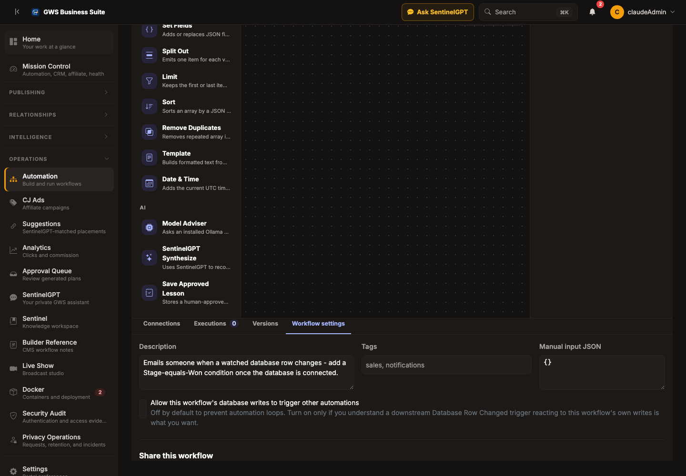

## Public status pages

Beyond internal sharing, you can publish a **read-only public status page** for a workflow —
useful for showing a client or affiliate that an automation is healthy without giving them any
suite access at all. It reuses Sentinel's existing public-share-link infrastructure (the same
token/password/expiry mechanism used for sharing a Sentinel page), and shows only the workflow's
name, description, current status, and recent run outcomes — never node configuration,
credentials, or any run's actual input/output data:

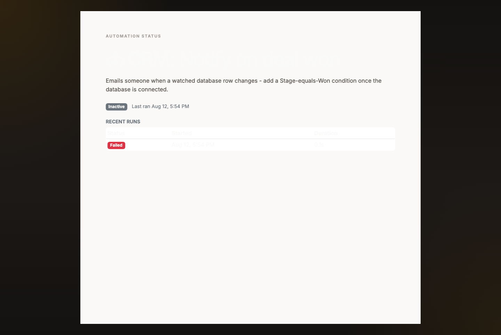

Optional expiry and password protection are available when you create the link, same as any other
Sentinel public share.

## Starter workflows and templates

**New from template** offers two sources:

- **Starter workflows** — a small, curated, built-in gallery (currently: CRM deal-won notify,
  scheduled digest, webhook relay) meant as realistic starting points, not blank-canvas examples.
  These are never stored as editable database rows — using one always creates a brand-new workflow
  with fresh node/connection ids, the same "portable graph, fresh identity" mechanism import uses.
- **Your templates** — any workflow you've saved via **Save as template** from its own toolbar.
  Templates preserve full canvas layout (unlike a published version snapshot, which is
  position-free), so reusing one looks the same as when you saved it.

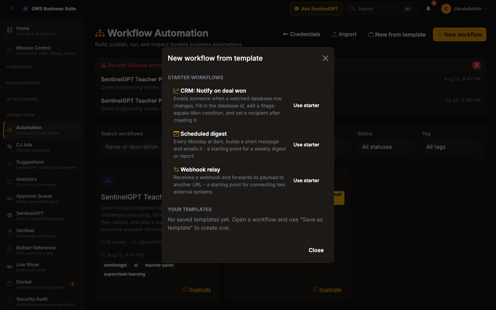

## Import and export

**Export** downloads the current draft (nodes, connections, positions) as a versioned JSON file.
**Import** reads that same file back and always creates a *new* workflow with fresh ids — merging
an import into an existing draft isn't supported, specifically to avoid corrupting in-progress
work. An import with an unrecognized format version is rejected with a clear error rather than
silently misinterpreted.

## Agentic authoring with SentinelGPT

Ask SentinelGPT (top-right of any admin page) to draft a workflow in plain English — e.g. *"watch
for CRM deals over $10k and notify me."* SentinelGPT proposes a full node/connection graph using
only real node types, and the proposal pauses for you to **Confirm** or **Decline** before
anything is created — the same governed propose/confirm pattern already used for AI-proposed
Sentinel database writes. A confirmed proposal is always created as an **inactive Draft**, never
published or activated automatically, so a bad AI-authored graph can't run anything until a human
reviews it, connects any needed credentials, and explicitly publishes. This pass covers *creating*
a new workflow from a request; editing an *existing* workflow's graph via chat isn't built yet.

## Suite-wide search and Mission Control

Press **⌘K / Ctrl+K** anywhere in the admin portal to search across workflows, CRM records,
Sentinel pages/databases, CMS pages, articles, and affiliate offers in one palette — not just page
names. **Mission Control** (`/admin/mission-control`) gives a single-glance dashboard across
automation failures, CRM pipeline health, affiliate performance, and container health, with recent
automation failures linking straight to the workflow that failed.

## Mobile push approvals (server-side readiness)

The server-side contract for a future mobile app exists today: device registration, a
cross-workflow list of pending Approval waits, and an approve/reject endpoint. **Real push
delivery is not implemented** — there's no APNs/FCM configuration and no MAUI mobile client in
this environment. A future mobile client could already *poll* the pending-approvals endpoint
without needing push credentials at all; true push notification is a clearly-flagged follow-up,
not a silent gap.

## Security and audit trail

Publish, activate/deactivate, and approval-resolve actions on every workflow are recorded into the
suite's unified, tamper-evident security audit stream (the same hash-chained log used for
login/MFA/privacy events) — visible under Operations → Security Audit. Routine execution runs
themselves are *not* duplicated into this stream; every run already has its own full evidence
trail in the workflow's own Executions tab, so repeating that volume in the audit log would be
noise rather than signal. What's captured here is specifically the governance actions a compliance
review would care about.

## End-to-end tutorial: notify on a big CRM deal

1. From `/admin/automation`, click **New workflow**, name it "Big deal alert."
2. In the palette, drag **CRM Deal Stage Changed** onto the canvas as your trigger. Select it and
   set `toStage` to `Won`.
3. Drag a **Notify** node onto the canvas. Connect the trigger's output to it.
4. Select the Notify node and set `to` to your email, `subject` to something like `Deal won!`, and
   `message` to `{{ $json.stage }} deal for contact {{ $json.contactId }}`.
5. Click **Validate** — it should report no errors (a trigger and at least one node, connected, no
   cycles).
6. Click **Publish**, then flip the status toggle from Inactive to **Active**.
7. From now on, whenever any CRM deal's stage changes to Won, this workflow's execution shows up
   in its own Executions tab, and you get an email.
8. Anytime later, open a specific execution and click **Replay** to see whether today's
   logic — after any edits you've since made — would still notify for that same deal.

## Known limitations

These are deliberate scope boundaries, not oversights:

- **No general expression language.** `{{ }}` expressions support dotted field paths only — no
  arithmetic, functions, or array indexing.
- **No code/shell execution node.** Sandboxing arbitrary code safely is real infrastructure work,
  intentionally not attempted yet.
- **Retry-from-node and Merge.** A node that failed while a sibling merge input was still in
  flight may not reconstruct that merge state perfectly on retry.
- **Sub-workflows can't call a workflow that pauses.** `Execute Workflow` requires the child to
  complete synchronously; a child that hits Wait/Approval throws a clear error instead of hanging.
- **Time-travel replay can't replay a paused run**, and fails clearly (rather than guessing) if
  today's logic reaches a side-effecting node the original run never recorded output for.
- **Per-workflow sharing is binary, not tiered.** A grant gives full control of one workflow, not
  a graded View/Edit/Comment split.
- **Mobile push approvals have no real push delivery** in this environment (see above) — the
  server-side contract exists; APNs/FCM credentials and a MAUI client do not.
- **CRM/Growth/security-audit-finding trigger nodes don't exist yet** for affiliate conversions or
  security findings specifically — investigated and intentionally not built, because this
  codebase has no live write path that records either event yet, so a trigger for them would be
  permanently unfireable dead code rather than a real feature.
- **Agentic authoring is create-only.** SentinelGPT can draft a brand-new workflow from a request;
  it can't yet edit an existing one's graph through chat.
- **Credential types are limited to `httpHeader`, `oauth2`, and generic.** No external secret
  store integration yet.
- **Single-process execution.** No queue transport, independent workers, or leader election —
  this runs in-process, backed by durable database records for crash recovery.
