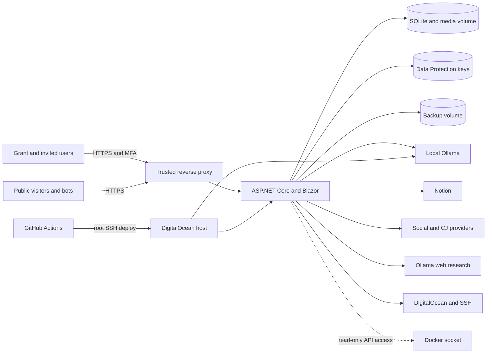

# GwsBusinessSuite threat model

**Status:** Active release-security baseline  
**Reviewed:** 2026-08-01
**Scope owner:** Grant Watson  
**Target:** Private GWS deployment for Grant and explicitly invited portal accounts

## Executive summary

GwsBusinessSuite is an internet-reachable, single-tenant business operations suite that stores private workspace content, credentials for external integrations, analytics, generated content, and operational deployment data. The intended users are Grant and explicitly invited portal users; it is not a public multi-tenant SaaS product. Employer-confidential information is permitted, so mandatory multi-factor authentication (MFA) is a release requirement.

The repository already contains meaningful protections: mandatory TOTP MFA with recovery codes and replay prevention, hashed passwords and account lockout, role policies with an admin fallback, antiforgery validation, per-IP rate limits, Data Protection-backed secret encryption, bounded uploads/responses, outbound workflow SSRF checks, encrypted restore-tested backups, and automated build/test/readiness gates. The highest remaining risks are privileged host access, confidential-data egress to AI/web providers, incomplete lifecycle/legal operations, and production recovery/key-escrow acceptance.

The security objective is a private-business baseline aligned to the safeguard rigor of the HIPAA Security Rule and the privacy/security duties of GDPR. This document is an engineering threat model, not a statement of HIPAA certification, GDPR compliance, or legal advice. If GWS stores regulated ePHI as a covered entity or business associate, contractual, organizational, risk-analysis, incident-response, and business-associate obligations also apply beyond code.

## Scope and assumptions

In scope:

- The ASP.NET Core/Blazor Server portal and its authenticated admin, author, and contributor experiences.
- The public CMS/blog, forms, analytics ingestion, comments, resume hooks, public media, and Live Show viewer entry points in `src/GwsBusinessSuite.Web/Program.cs`.
- SQLite application data, media/recordings, Data Protection keys, and backups managed by `ApplicationDbContext` and the Docker volumes in `docker-compose.yml`.
- Sentinel, Notion import/sync, SentinelGPT/Ollama, internet research, automation HTTP actions, social publishing, Docker health, DigitalOcean, and SSH functions.
- GitHub Actions deployment to the DigitalOcean droplet (`.github/workflows/deploy.yml`).
- The signed/notarized macOS wrapper where it authenticates to the same hosted portal.

Assumptions:

- Only Grant and explicitly invited portal accounts are authorized; unrelated customers will not receive separate workspaces.
- Employer-confidential material is allowed only after mandatory MFA is enforced for every portal account.
- Production access uses an HTTPS reverse proxy/tunnel that supplies trusted forwarded headers. Direct public HTTP access is not an accepted production access path.
- The DigitalOcean account, GitHub repository, DNS/Cloudflare account, Notion integration, social-provider apps, Ollama web-search provider, and administrator devices are separately secured with MFA.
- HIPAA-strict and GDPR-aligned controls are desired even when a particular record is not legally regulated ePHI or EU personal data.

Open governance questions to resolve before handling ePHI in production:

- Whether GWS is acting for a HIPAA covered entity/business associate and which vendors require Business Associate Agreements.
- The approved retention periods for portal audit events, analytics identifiers, chat content, form submissions, backups, and deleted records.
- The responsible person and notification workflow for security incidents and personal-data breaches.

## System model

### Primary components

| Component | Security-relevant responsibility | Repository evidence |
|---|---|---|
| ASP.NET Core web app | Authentication, authorization, public/admin HTTP routes, Blazor circuits, security middleware | `src/GwsBusinessSuite.Web/Program.cs` |
| Custom account service | Password hashing, account lockout, roles, activation, password reset | `src/GwsBusinessSuite.Infrastructure/Services/UserManagementService.cs`; `src/GwsBusinessSuite.Domain/Entities/CoreEntities.cs` (`AppUser`) |
| SQLite/EF Core | Primary private and public content, user, integration, analytics, workflow, and audit-adjacent records | `src/GwsBusinessSuite.Infrastructure/Data/ApplicationDbContext.cs` |
| Data Protection/secret protector | Encrypts connector and infrastructure credentials at rest and protects OAuth state | `src/GwsBusinessSuite.Infrastructure/Services/DataProtectionSecretProtector.cs`; `src/GwsBusinessSuite.Web/Program.cs` |
| Sentinel/Notion | Imports workspace pages, databases, blocks, attachments, OAuth/webhook data | `src/GwsBusinessSuite.Infrastructure/Services/NotionSyncService.cs`; `/api/integrations/notion/webhook` in `Program.cs` |
| SentinelGPT/Ollama | Sends workspace-derived context to local models and optionally sends research requests to the configured web provider | `src/GwsBusinessSuite.Infrastructure/Services/SentinelGptService.cs`; `OllamaWebSearchService.cs` |
| Automation/infrastructure tools | Makes outbound HTTP requests and can access Docker/SSH/DigitalOcean operations | `AutomationHttpClient.cs`; `DockerHealthService.cs`; `SshTerminalService.cs`; `DigitalOceanService.cs` |
| Public site/analytics | Serves CMS/blog/media and ingests public events, comments, and forms | Public endpoint mappings in `src/GwsBusinessSuite.Web/Program.cs` |
| Docker host | Runs web and Ollama containers; persists application, backup, and model volumes | `docker-compose.yml` |
| CI/CD | Tests, SSHes as root, replaces checkout with `origin/main`, rebuilds containers, checks readiness | `.github/workflows/deploy.yml`; `scripts/verify-release.sh` |

### Data flows and trust boundaries

1. A browser or macOS wrapper crosses the internet boundary to the HTTPS proxy and then the ASP.NET Core container. Public routes remain anonymous; portal routes use cookie authentication and role authorization.
2. The application reads and writes confidential records in SQLite and filesystem-backed volumes. Data Protection keys on the persistent data volume encrypt stored connector secrets and authentication cookies.
3. Authenticated administrators can cause outbound traffic to Notion, social providers, DigitalOcean, arbitrary public workflow HTTP destinations, and the Ollama web-search service. These are explicit data-egress boundaries.
4. SentinelGPT sends selected suite context to local Ollama over the Compose network. When web research is enabled, search queries/URLs cross to an external provider; fetched content returns as untrusted input.
5. The web container mounts the Docker socket read-only. Despite read-only mounting, Docker API exposure remains host-sensitive and must not be treated like an ordinary file permission.
6. GitHub Actions crosses an administrative boundary using a root SSH credential to mutate the production checkout and Docker stack.

## Assets and security objectives

| Asset | Confidentiality | Integrity | Availability/privacy objective |
|---|---|---|---|
| Employer-confidential and Sentinel workspace content | Critical | Critical | Available only to authorized invited users; access is attributable and revocable |
| Possible ePHI and personal data | Critical | Critical | Minimum necessary access; auditable access/change; retention, deletion, export, and breach handling |
| Password hashes, MFA secrets/recovery codes, session cookies | Critical | Critical | Never logged or exposed; phishing/brute-force resistant; promptly revocable |
| Notion, social, web-search, DigitalOcean, SSH, and TURN secrets | Critical | Critical | Encrypted at rest; least privilege; rotatable; never sent to models or browsers |
| SQLite database, media, recordings, and backups | Critical | Critical | Encrypted and tested backup/restore; protected from unauthorized export or deletion |
| Published CMS, analytics, and social content | Moderate | High | Changes attributable; publication requires appropriate role/confirmation |
| Audit/security events | High | Critical | Tamper-resistant enough for investigation; retained per policy; no secret payloads |
| Production host and CI/CD credentials | Critical | Critical | Least privilege, MFA on control planes, reproducible deploys, recoverable rollback |

## Attacker model

Capabilities considered:

- Remote unauthenticated probing, credential stuffing, password spraying, bot/spam submissions, oversized input, and route enumeration.
- A malicious or compromised invited portal account operating within or attempting to exceed its role.
- A stolen password, session cookie, API token, CI secret, administrator browser, or work computer.
- Malicious content from Notion imports, uploads, public comments/forms, web search, workflow responses, and third-party scripts.
- SSRF/DNS rebinding attempts against internal services and metadata endpoints.
- Supply-chain compromise of a NuGet/npm/Action/container dependency.
- Host/container compromise and malicious use of Docker/SSH/DigitalOcean capabilities.

Not assumed:

- Cryptographic breaks in current .NET primitives.
- Physical or hypervisor compromise at DigitalOcean as the initial foothold.
- Strong workspace isolation between unrelated customers; the product is explicitly single-tenant/private.

## Entry points and attack surfaces

| Surface | Trust level | Current controls | Principal risk |
|---|---|---|---|
| `/auth/login` and portal cookie | Internet/untrusted | Password hash, per-account lockout, per-IP rate limit, antiforgery, role claims | No MFA; session theft; distributed guessing |
| Blazor Server circuit/admin APIs | Authenticated | Fallback admin policy, named role policies, antiforgery, mutation limits | Broken authorization, CSRF, long-lived/stolen sessions |
| Public CMS/blog/media APIs | Anonymous | Host constraints on many routes, read limits, output encoding/rendering | Accidental private publication, stored XSS, scraping/DoS |
| Forms/comments/analytics/hooks | Anonymous | Write limits, validation, tokenized hook | Spam, forged events, personal-data overcollection |
| Notion OAuth/webhook/sync/import | External provider/untrusted content | Protected OAuth state, encrypted token, webhook verification, mapping/limits | Token theft, malicious content/archive, excessive import |
| SentinelGPT and web research | Authenticated plus external content | Local model, explicit web setting, result bounds, HTTPS URL checks | Confidential prompt/query egress, prompt injection, false action claims |
| Automation HTTP | Authenticated/admin-configured | Scheme validation, DNS resolution, private/reserved address denial, 5 MB response cap | DNS rebinding/redirect SSRF, credential exfiltration |
| Uploads/ZIP/media/recording | Authenticated or selected public reads | Size/type checks in services/components, IDs rather than raw paths | Parser abuse, decompression/space exhaustion, active content |
| Docker/SSH/DigitalOcean | Admin | Encrypted credentials, audit records, read-only socket mount | Host takeover and total data compromise |
| CI/CD and dependencies | Repository/control plane | Full test/release harness, dependency audit, readiness check | Root-key theft, mutable Actions/images, malicious dependency |
| Third-party browser scripts | Public browser | Limited placement | Tracking, supply-chain script compromise, CSP bypass |

## Top abuse paths

1. **Stolen password to confidential portal access:** an attacker reuses a phished password, passes `/auth/login`, and receives the full portal session because no second factor is required. Mitigate with mandatory TOTP now and phishing-resistant passkeys as the target.
2. **Stolen session from an administrator endpoint:** malware, an insecure HTTP path, or browser compromise captures the cookie and obtains broad fallback-admin access. Enforce HTTPS-only production cookies, shorter absolute lifetime, security-stamp/session revocation, and reauthentication for sensitive actions.
3. **Compromised portal admin to host takeover:** an attacker uses stored SSH/DigitalOcean functions or Docker API access to control production and extract the database, keys, and backups. Separate infrastructure administration from the web process and require step-up MFA/confirmation.
4. **Confidential prompt leakage through internet research:** a user enables web research on a prompt containing employer data; the search query crosses to an external provider. Add prominent egress disclosure, automatic secret/identifier redaction, policy controls, and an auditable per-request decision.
5. **Untrusted retrieved/imported text manipulates AI behavior:** content from web search or Notion contains instructions that SentinelGPT treats as authoritative, leading to disclosure or unsafe suggested/actions. Delimit untrusted sources, restrict tool execution, and require confirmation plus server evidence.
6. **SSRF through automation or fetch redirects:** a public URL resolves safely but redirects or rebinds to a private/metadata address. Disable automatic redirects or validate every hop and connect to the validated address.
7. **Malicious or oversized archive/media exhausts the host:** compressed imports, recordings, or media consume memory/disk/CPU or exploit a parser. Enforce aggregate uncompressed/file-count limits, content signatures, storage quotas, and cleanup jobs.
8. **Public endpoint privacy/spam abuse:** attackers forge analytics, comments, forms, or resume events, polluting data and accumulating identifiers. Minimize collection, add consent/retention, bot defenses where needed, and distinguish observed traffic from authenticated facts.
9. **CI or root SSH key compromise:** a repository/control-plane attacker deploys arbitrary code and reads every secret. Replace root deployment with a constrained account, protect environments, pin Actions by commit, and rotate/review credentials.
10. **Backup plus key theft defeats at-rest secret protection:** host access yields SQLite/backups and co-located Data Protection keys. Encrypt backups with a separately controlled key and test isolated restore/access procedures.

## Threat register

| ID | Threat | Preconditions | Impact | Existing controls | Required mitigation | Priority |
|---|---|---|---|---|---|---|
| TM-001 | Portal authentication bypass or MFA recovery weakness | Password stolen/guessed or recovery material exposed | Full confidential-data access | Mandatory TOTP enrollment/challenge, one-time hashed recovery codes, replay prevention, hashing, account lockout, IP limit, MFA tests | Complete deployed MFA acceptance; add WebAuthn/passkeys and session revocation after credential changes as defense in depth | **P0 Critical (mitigated locally)** |
| TM-002 | Session theft or insecure direct HTTP access | Cookie observed/stolen | Account takeover | HttpOnly cookie defaults, SameSite Lax, HSTS through HTTPS | Production Secure=Always, HTTPS enforcement at edge/firewall, absolute timeout, revoke sessions after password/MFA changes | **P0 High** |
| TM-003 | Excessive admin-to-host privilege | Admin/session or web container compromised | Total host/data compromise | Admin authorization, encrypted secrets, action logs, socket mounted read-only | Remove Docker socket from web app; broker allow-listed read operations; constrain SSH/deploy account; step-up auth | **P0 High** |
| TM-004 | Confidential data sent to external AI research | Web mode used with sensitive prompt | Employer/personal/ePHI disclosure | Explicit web mode, server-held API key, bounded results | Egress warning/consent, redaction/DLP, domain/purpose policy, audit without prompt body, provider data agreement review | **P0 High** |
| TM-005 | Incomplete HIPAA/GDPR accountability and lifecycle controls | Confidential/personal/ePHI stored | Undetected access, over-retention, failed rights/incident response | Central tamper-evident security ledger, encrypted network context, metadata-only evidence, integrity readiness check, admin search/export, identity-gated subject export, retention register/previews, rights deadlines, incident register, breach assessment and 72-hour clock | Approve the legal retention schedule, add reviewed erasure execution and legal holds, rehearse the incident runbook, and complete access reviews | **P0 High (partially mitigated)** |
| TM-006 | SSRF/DNS rebinding/redirect bypass | Admin configures malicious URL or content supplies URL | Internal service/metadata access, token theft | Initial DNS/private-range checks, HTTPS restriction in web fetch, response caps | Validate every redirect/hop, disable redirects by default, block metadata ranges including IPv4-mapped IPv6, outbound allow-lists for sensitive jobs | **P1 High** |
| TM-007 | Prompt injection causes unsafe disclosure/action | Malicious Notion/web content reaches model | Data disclosure or destructive/false action | Grounding/citation concepts, confirmation expectations | Treat retrieved text as data, tool-specific allow-lists and authz, confirmations, idempotency, verified action receipts | **P1 High** |
| TM-008 | Upload/archive/storage abuse | Authenticated uploader or public recording path abused | DoS, storage loss, parser compromise | Per-file bounds and endpoint limits | Aggregate ZIP limits, file-count/ratio limits, signature validation, quotas, malware scanning where warranted | **P1 Medium** |
| TM-009 | Public ingestion poisoning/privacy overcollection | Anonymous requests | Bad analytics, spam, personal-data liability | Per-IP write limits and validation | Consent/minimization, retention/anonymization, CSP-safe anti-bot option, provenance flags, deletion/export | **P1 Medium** |
| TM-010 | Third-party JS and dependency compromise | CDN/vendor/package compromised | Tracking, browser/session compromise, malicious deploy | Dependency audit; limited CORS | Strict CSP/nonces, self-host critical assets, SRI where possible, inventory/consent for CJ tracking, pin Actions/images | **P1 High** |
| TM-011 | Backup/key co-location | Host/volume access | Offline database and secret recovery | Transactional encrypted/authenticated backups, separate backup volume, external-or-excluded encryption key, matching Data Protection keys, recording capture, signed manifest, tamper and isolated-restore tests, retention and readiness checks | Escrow the production encryption key off-host, configure encrypted off-host archive copies, and complete a production restore/access rehearsal | **P1 High (partially mitigated)** |
| TM-012 | Single-host outage/resource exhaustion | Disk/OOM/model load/host loss | Portal and recovery outage | Health checks, restart policies, model concurrency bounds, backups | Capacity alerts, off-host backups, documented restore/RTO/RPO, rollback and disk-pressure tests | **P1 Medium** |

## Criticality calibration

- **P0 Critical:** credible path to confidential-data access that violates an explicit launch condition. TM-001 remains open only until mandatory MFA completes deployed acceptance.
- **P0 High:** credible full-account/host compromise, regulated-data disclosure, or absence of essential accountability. Must be resolved or explicitly risk-accepted before the 1.0 release.
- **P1 High/Medium:** material defense-in-depth, privacy, supply-chain, or availability work required immediately after the P0 gate and before expanding users/data sources.
- **P2:** low-impact hardening and usability improvements tracked in `docs/RELEASE_READINESS.md` after the main trust boundaries are controlled.

## Focus paths security review

### Identity and session security

- Implement mandatory MFA before the first confidential production session. Existing accounts must enter a short-lived pre-authentication state and enroll; new invited accounts must enroll on first successful password verification.
- Store TOTP seeds encrypted with a purpose-specific Data Protection protector. Store recovery codes only as one-way hashes, reveal them once, and invalidate each on use.
- Rate-limit MFA endpoints by IP and account, reject replay of an already accepted TOTP time step, and never log codes/seeds.
- Make password or MFA reset revoke existing sessions. Add a session/security stamp to claims and validate it periodically.
- Prefer passkeys/WebAuthn as the phishing-resistant follow-up; do not use SMS as the primary factor.

### Confidentiality, privacy, and compliance operations

- Maintain a data inventory and classification for employer confidential, personal, health, secret, and public data.
- Apply minimum-necessary role access and quarterly access reviews for invited accounts.
- Add searchable security audit events for authentication, account/MFA changes, exports, deletes, connector changes, AI egress, publication, infrastructure actions, and administrative reads of highly sensitive data.
- Implemented 2026-08-01: the central append-only ledger now covers authentication, authorization denials, account administration, and audit exports; integrity is checked by readiness. Connector, AI egress, publication, infrastructure, deletion, and sensitive-read coverage remains open.
- The Privacy Operations register now previews retention eligibility without deleting data and requires explicit automation approval. Legal owners must approve the schedule before a purge job is enabled; chats, recordings, backups, legal holds, and reviewed erasure remain open.
- Privacy Operations now records access/erasure/correction/restriction requests, applies a one-month target, gates exports on identity verification, and omits authentication secrets. Reviewed erasure execution remains open.
- Privacy Operations now records incidents, containment/resolution state, ePHI involvement, breach risk and regulator-notification decisions, and starts a 72-hour escalation clock from recorded awareness. A production rehearsal and notification runbook remain open.

The one-month rights target and 72-hour breach clock follow the [EU GDPR operational guidance](https://europa.eu/youreurope/business/governance-and-sustainability/digital-and-data-compliance/data-protection-gdpr/index_en.htm). The six-year security/audit evidence default follows [HHS documentation guidance](https://www.hhs.gov/hipaa/for-professionals/security/laws-regulations/index.html); [HIPAA itself does not establish a general medical-record retention period](https://www.hhs.gov/hipaa/for-professionals/faq/580/does-hipaa-require-covered-entities-to-keep-medical-records-for-any-period/index.html). These are engineering defaults and require legal/policy approval for GWS's actual role and jurisdictions.

### Infrastructure and supply chain

- Stop binding production port 80 publicly; expose it only to the trusted tunnel/proxy and force external HTTPS.
- Remove general Docker socket access from the web app. A read-only mount can still expose sensitive daemon/container metadata and expands impact if the client/API permits dangerous behavior.
- Replace root SSH deployment with a least-privileged deploy account and tightly constrained sudo commands. Protect the production GitHub Environment with approvals and credential rotation.
- Pin third-party GitHub Actions and important container images by immutable digest, generate an SBOM, continue vulnerability audit gates, and document patch SLAs.
- Keep encrypted off-host backups under a key not stored beside the database; test restore and record RPO/RTO evidence.

### AI and integration safety

- Keep model inference local by default. Treat web research as explicit external disclosure and show the active mode at send time.
- Prevent secrets and high-risk identifiers from entering search queries with deterministic scanning/redaction; do not send full workspace context to research providers.
- Treat all retrieved and imported content as untrusted. It must not override system/tool policy or authorize actions.
- Require current user authorization at execution time, explicit confirmation for destructive/expensive/external-posting actions, idempotency keys, and server-confirmed receipts.
- Review provider retention/training terms and required data-processing/BAA arrangements before sending regulated content.

## Release acceptance evidence

The following evidence is required before this threat model can be marked accepted:

- Automated MFA enrollment, verification, replay, recovery-code, lockout, reset, and authorization tests.
- Browser validation of first-login enrollment and returning-login challenge on desktop and narrow layouts.
- Production verification that HTTP cannot reach the app externally and authentication cookies are always Secure.
- Security/privacy audit-event coverage and a documented access-review, retention, incident-response, and breach process.
- Restored off-host backup drill with recorded RPO/RTO and separate-key access.
- Focused SSRF redirect/rebinding tests, upload/archive exhaustion tests, and AI egress/prompt-injection tests.
- A release harness PASS plus a clean dependency audit and deployed `/health/live`, `/health/ready`, and login/MFA smoke checks.
